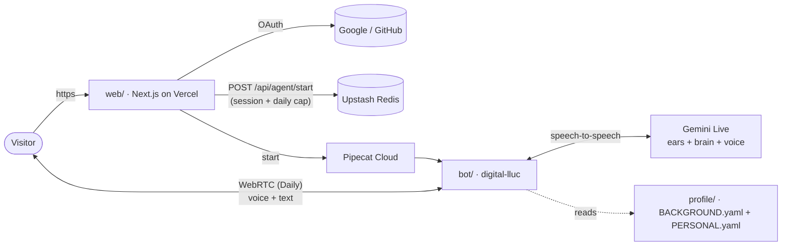

# my-site — talk to digital-lluc


My personal website. The main product is not a portfolio — it's a
conversation: **digital-lluc**, a first-person AI version of me you can
talk to by voice or text, built on the same Pipecat stack I work on
professionally.



## One feature, four modes

The console on the landing page is a single Pipecat session; the audio
toggles select the modality — transcript always visible, typing always
available:

| mic | voice out | you get                          |
| --- | --------- | -------------------------------- |
| off | off       | text chat                        |
| off | on        | type, read + hear the replies    |
| on  | on        | full voice conversation          |

## Layout

- `web/` — Next.js 16 app (Vercel): terminal-style console UI, Auth.js
  (Google + GitHub), `/api/agent/start` with a per-user daily session cap
  (Upstash Redis), blog scaffolding under `content/blog/`.
- `bot/` — Pipecat bot (Pipecat Cloud): Gemini Live speech-to-speech
  (one model as ears, brain and voice, with built-in transcription),
  persona compiled from `profile/`, hard session/idle timeouts.
- `profile/` — the canonical background YAML the persona is built from
  (`BACKGROUND.yaml` synced from the my-profile repo, plus
  `PERSONAL.yaml` for everything off the clock).

## Local development

```bash
# bot (terminal 1) — uv-managed (Python >= 3.13, pipecat 1.5.0)
cd bot && uv sync
cp .env.example .env   # fill GOOGLE_API_KEY (aistudio.google.com)
uv run bot.py --transport webrtc --port 7080

# web (terminal 2)
cd web && npm install
cp .env.example .env.local   # leave PIPECAT_CLOUD_* empty → uses local bot
npm run dev
```

Set `DEV_ALLOW_ANONYMOUS=1` in `web/.env.local` to skip login while
developing.

## Deploy

- **Bot**: `docker build -f bot/Dockerfile -t <registry>/digital-lluc:0.1 .`,
  push, then `pcc deploy` from `bot/` (secrets live in the
  `digital-lluc-secrets` set on Pipecat Cloud).
- **Web**: import `web/` as a Vercel project; set the env vars from
  `web/.env.example` (plus `PIPECAT_CLOUD_*` and Upstash).
